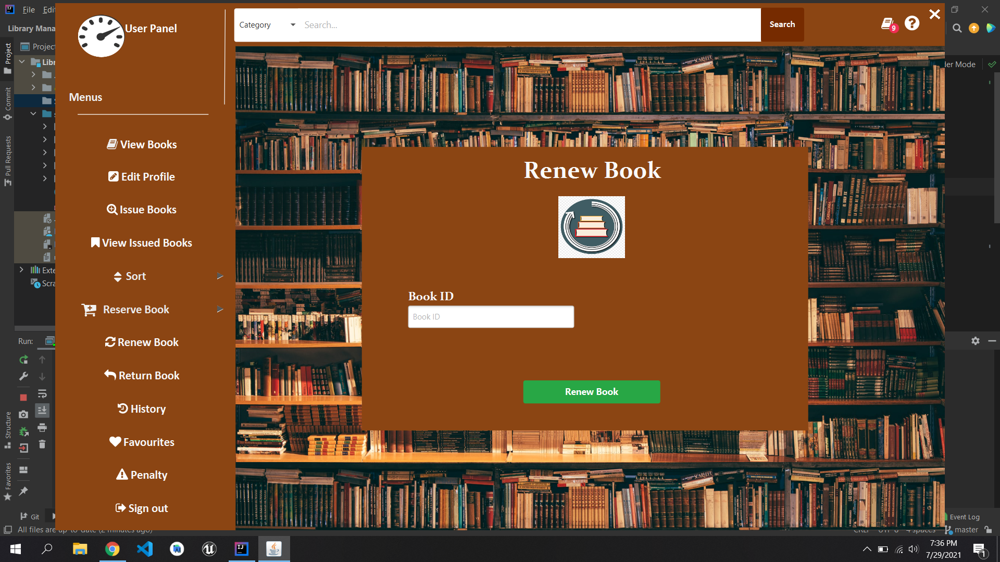

# Library_Managment_System
A Simple Library Managment System built in java using javafx by following Solid design Principles.

Functionlites:

User can Update his profile can issue reserve return and renew the book.

User is only allowed to issue at max 3 books and reserve 3 books at a time.

User can also Add the book to his favourites list.

User can see his history of issued books.

User will pay fine if failed to return book within due date.

Admin can add delete and Update the Book.

 
 
 

 
 
 

